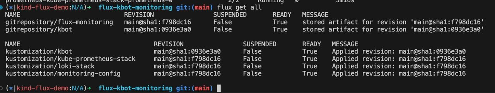
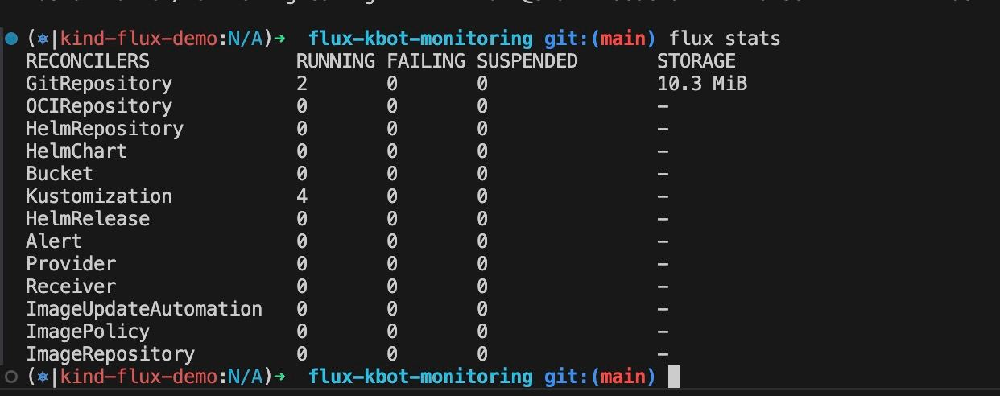
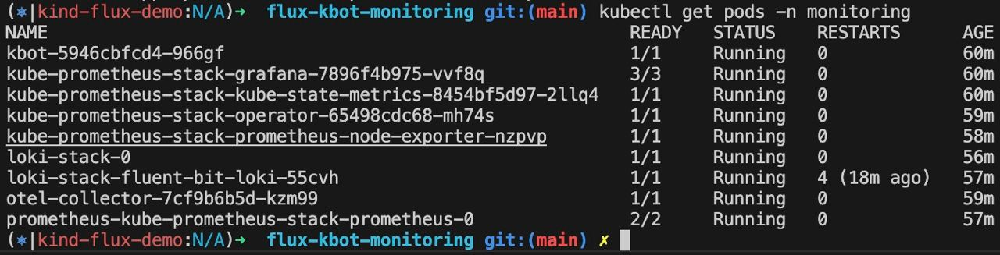
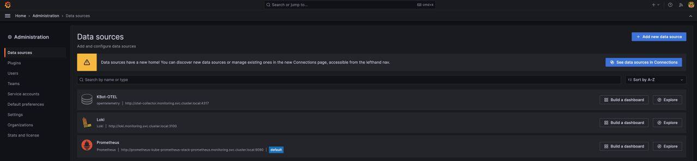
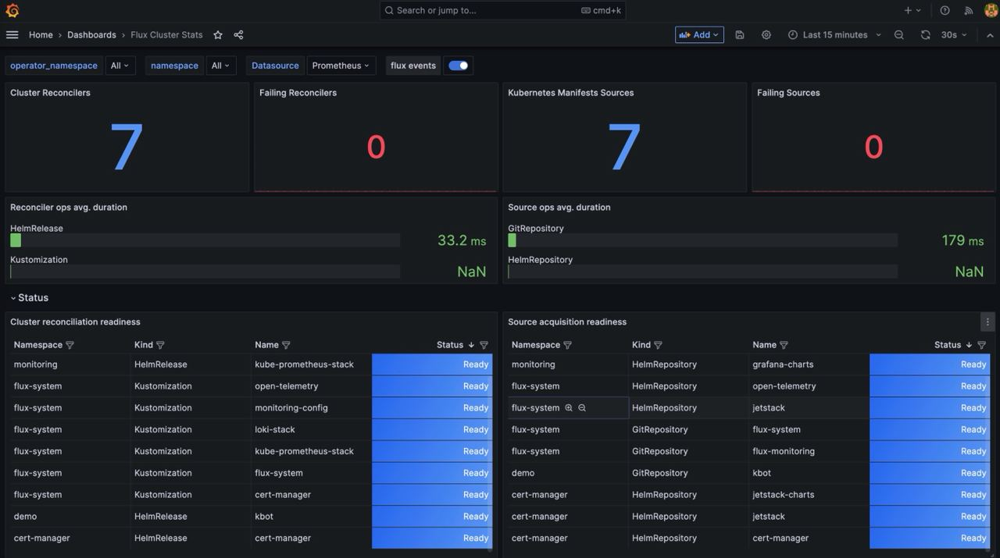
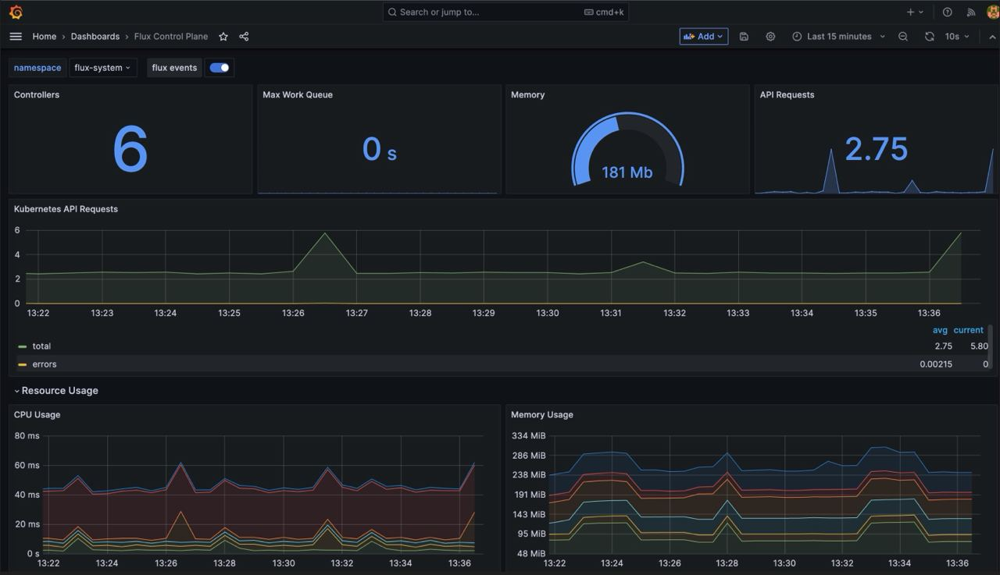
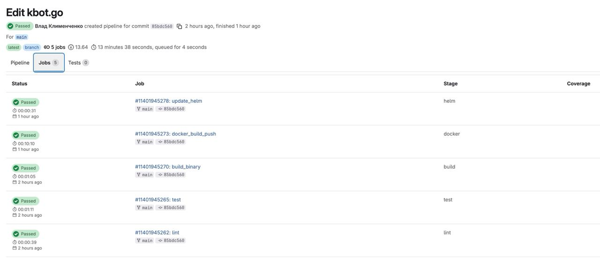

# Flux Monitoring Stack

`flux-monitoring` provides a setup for monitoring a Kubernetes cluster with **Flux**, **Prometheus**, **Loki**, **Fluent-bit**, and **Grafana**.  

This stack enables:  
- Collection of metrics from applications and cluster components  
- Centralized log aggregation and analysis  
- Visualization with Grafana  

---

## Components

- **OpenTelemetry** - Framework for collecting metrics, logs, and traces from distributed systems for observability.
- **Flux** — GitOps operator for automated reconciliation of configuration.  
- **Prometheus** — Monitoring system for collecting metrics.  
- **Loki** — Log aggregation system optimized for Kubernetes.  
- **Fluent-bit** — Lightweight log collector and forwarder.  
- **Grafana** — Dashboard and visualization platform.  

---

## Installation

This setup assumes that **Flux is already installed and configured** in your cluster.  

### 1. Register the Git repository

```bash
flux create source git flux-monitoring \
  --interval=30m \
  --url=https://github.com/ARmrCode/flux-kbot-monitoring \
  --branch=main
```

---

### 2. Install Prometheus Stack

```bash
flux create kustomization kube-prometheus-stack \
  --interval=1h \
  --prune \
  --source=flux-monitoring \
  --path="./monitoring/kube-prometheus-stack" \
  --health-check-timeout=5m \
  --wait
```

---

### 3. Install Loki + Fluent-bit

```bash
flux create kustomization loki-stack \
  --depends-on=kube-prometheus-stack \
  --interval=1h \
  --prune \
  --source=flux-monitoring \
  --path="./monitoring/loki-stack" \
  --health-check-timeout=5m \
  --wait
```

---

### 4. Deploy Grafana Dashboards

```bash
flux create kustomization monitoring-config \
  --depends-on=kube-prometheus-stack \
  --interval=1h \
  --prune=true \
  --source=flux-monitoring \
  --path="./monitoring/monitoring-config" \
  --health-check-timeout=1m \
  --wait
```

---

### 5. Reconcile resources manually

```bash
flux reconcile source git kbot
flux reconcile kustomization kbot
```

---

## Accessing Grafana

Forward the Grafana service port:

```bash
kubectl -n monitoring port-forward svc/kube-prometheus-stack-grafana 3000:80
```

To bind to all interfaces:

```bash
kubectl --namespace monitoring port-forward --address 0.0.0.0 svc/kube-prometheus-stack-grafana 3000:80
```

Retrieve the Grafana admin password:

```bash
kubectl get secret --namespace monitoring kube-prometheus-stack-grafana \
  -o jsonpath="{.data.admin-password}" | base64 --decode ; echo
```

Grafana will be available at: [http://localhost:3000](http://localhost:3000)  

---









---

## References

- [Flux Monitoring Guide](https://fluxcd.io/flux/guides/monitoring/)  
- [OpenTelemetry Operator](https://github.com/open-telemetry/opentelemetry-operator)  
